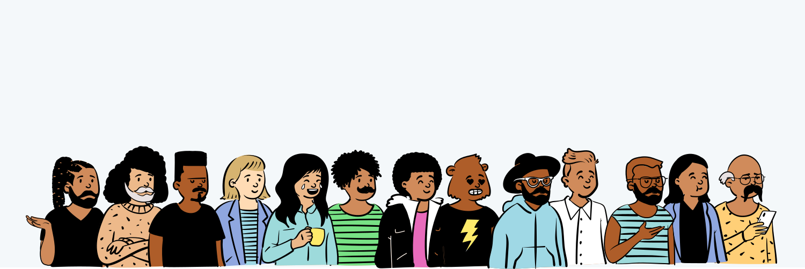
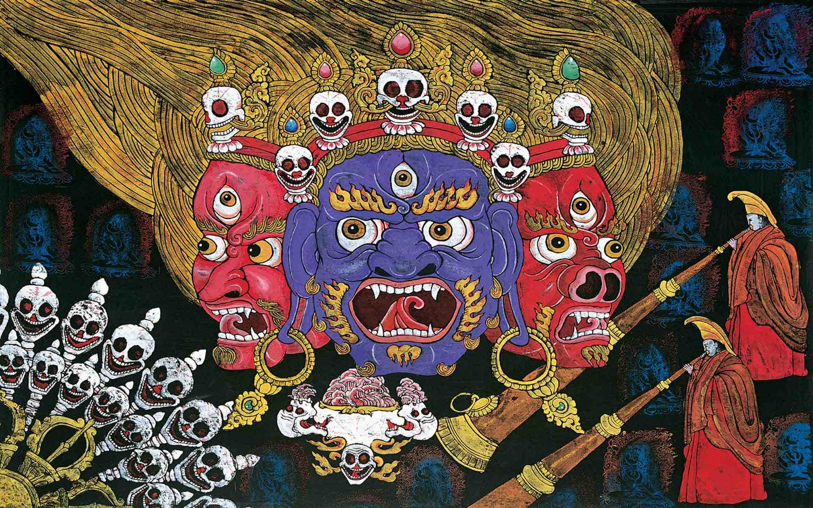
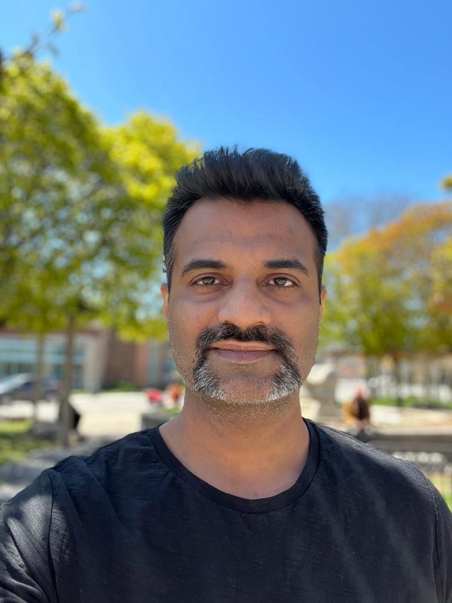

title: About Octallium
description: Get to know what drives Octallium

# Octallium

<!-- <iframe width="680" height="382" src="https://www.youtube.com/embed/NbqhRSqtWQs" frameborder="0" allow="accelerometer; autoplay; encrypted-media; gyroscope; picture-in-picture" allowfullscreen></iframe> -->

Today's world is filled with diversity, we all come from different backgrounds and yet some traits remain common amongst all of us. All of us have to learn so many thing since our birth, programming is one such thing and it just happens to be logical extension of your curiosity.

If you are on such a journey, you have perhaps come to the right place! Sounds interesting ? Carry on...

## Introduction

**Programming languages** were made by people for people, but some of the creators got a little creative on the way and came up with strange symbols and syntax, couldn't programming be done in plain English or Marathi or Japanese or in your mother tongue? Perhaps not!

It takes a lot more to bring all the **diversity and complexity** of the real world and pack it in a programming language, however I do agree some programming languages feel weird, sometimes I even thought learning Martian would have been better!

But why would anyone choose to learn such cryptic sounding stuff?

Answer - **To make or break things!**

## Learning

**Octallium** presents easy to understand **videos, tutorials and articles** to navigate through these cryptic things in the most simplest way possible. Majority of the content starts for beginners and then progressively builds up till you can work on real life scenarios.

Every programming language is awesome only till the time it works for you and it's the worst when it doesn't, but it's really up to you which language you prefer, there is no **ONE** best language.

I love to call programming languages as **"demons"**, they offer great power, but you need to learn to handle them well.

How to I choose my choice of language? Carry on...

## Which demon to tame?

So which language you should learn? No one can answer that correctly, you need to experiment with different languages and choose your demon 🐲. However, depending on the scenario you would have to learn a certain language, e.g - for creating websites, you absolutely need to know HTML, CSS and some Javascript.

Its normal for anyone to learn more than half dozen languages in the course of their career. More you expose yourself to different languages, better would be your understanding.

Let the force be with you!

# About Me

Hi, my name is **Anil Kulkarni** and I am passionate about coding. I am a self learned programmer and enjoy my daily dose of coding. When I am not coding you can usually find me watching movies 🎬

## Background

I have done my majors in **Mechanical Engineering** and then completed **Masters In Marketing Management**, I'm also doing a Post Graduate Certificate in Business  Marketing at Seneca College, Toronto.

I was always passionate about creating things, in my last venture I was making "Handmade Soaps" and while making e-commerce website for it, coding bug caught up with me and I have been learning programming ever since.

I try to share whatever I learn. I am also open to any new opportunities, you can checkout my profile at -

[LinkedIn](https://www.linkedin.com/in/anilkulkarni22/)

[Github](https://github.com/evolutionengine/)

## Motivation

As a beginner I really struggled to find the right sources for learning and ended up taking a lot of free and paid online courses, which finally ended up in confusion and frustration. So I decided to write a simple to understand, beginner oriented resources for learning how to program.
