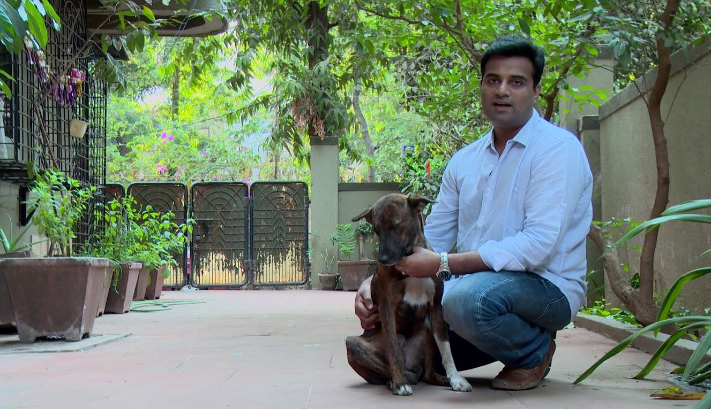

title: About Octallium
description: Get to know what drives Octallium

# About

Hi, my name is **Anil Kulkarni** and I am passionate about coding. I am a self learned programmer and enjoy my daily dose of coding. When I am not coding you can usually find me watching movies 🎬

## Background

I have done my Mechanical Engineering and then completed masters in Marketing Management, I was always passionate about creating things, my last venture was making "Handmade Soaps" and while creating an e-commerce website for it, the coding bug caught up with me and I have been learning programming ever since.

I am still a beginner and try to share whatever I learn. I am open to any new opportunities, you can checkout my profile at -

[LinkedIn](https://www.linkedin.com/in/anilkulkarni22/)

[Github](https://github.com/evolutionengine/)

You can contact me on - anil.kulkarni [at] gmail com

## Motivation

As a beginner I really struggled to find the right sources for learning and ended up taking a lot of free and paid online courses, which finally ended up in confusion and frustration. So I decided to write a simple to understand, beginner oriented resources for learning how to program.
