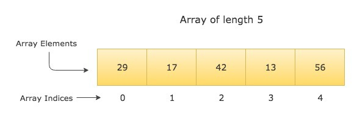

title: Arrays in Go (Golang)
description: Understanding Array's in Go.

# Understanding Data Structure of Type {++ Array++}.

<hr>

## Objective

Understanding {++ Array's++} in Go.


Imagine walking into an ice-cream store, you see all different flavor displayed nicely side-by-side, tempting isn't it ? You can easily see all the flavors and make your choice easily. This display of various ice-cream flavors is nothing but an "array" with the common item type of "ice-cream" !

Go offers a couple of in-build data structures and one of them is an "array", you can imagine array as a collection of similar items, i.e you can group together common items.

The advantage of array is that it gives you easy access to data, also data can be organized properly by using arrays, however arrays are fixed in size, to overcome this Go offers "slice" which we will cover in the next chapter.

## Structure

Navigate to our code folder

```bash
code/basic/
```

For our program create a new folder '11_array'

```bash
code/basic/11_array/
```

And lets create a file 'array.go' in it, finally the structure would look like this:

```bash
code/basic/11_array/array.go
```

## Declaration

Syntax

```go
var arrayName[size] type
```

Or declaration & initialization method

```go
arrayName := [size]type{value1, value2, ...}
```

## Code

We will write the code in 2 parts:

### 1) **Part-1** array.go

```go
package main

import "fmt"

func main() {
// declaring an array of type int
var array1 [5]int
fmt.Println("The values of array1 are:", array1)
fmt.Println("The length of array1 is:", len(array1))
fmt.Println()

// adding values into the array
fmt.Println("Adding values to array1")
array1[0] = 29
array1[1] = 17
array1[2] = 42
array1[3] = 13
array1[4] = 56
fmt.Println("Now the values of array1 are:", array1)
fmt.Println()

// Reading all values from array1 using for-range loop
fmt.Println("Reading all the values from array1 using for-range loop...")
for index, value := range array1 {
    fmt.Printf("Index: %d Value: %d\n", index, value)
}
fmt.Println()
```

_Review_

On line 7 we declare an array of type int with a length of 5 and print out the empty array.

```go
var array1 [5]int
```

On line 9 we print out the length of the array using a built-in function "len".

```go
fmt.Println("The length of array1 is:", len(array1))
```

From line 14 to 18 we initialize values to the array and then finally print out the filled array. The final array will look like the below image.



> Did you notice that the index position starts from "0" and not from "1" !

So an array of length 5 will have index positions of 0, 1, 2, 3 & 4.

On line 24 we are using a "for-range" loop to print out the values, notice that we declare two variables "index" and "position" and then range over the array.

```go
for index, value := range array1
```

What this does is, it iterates over each element one by one and prints out the value & index, we don't have to declare variables and iterate, remember we used to write:

```go
for i:= 0; i < n; i++ {
    do something
}
```

Instead we can write it with much cleaner syntax using for-range loop, for-range loops are extensively used in Go. If you don't want to use any value, you can simply discard it using "\_" , for example if you do not want index position, you can declare for-range as:

```go
for _, value : range array1 {
    do something
}
```

The underscore "\_" simply tells the Go compiler to ignore the value.

### 2) **Part-2** array.go

``` go
// declaring an array of type string with shorthand method
cities := [5]string{"New York", "Seattle", "Mumbai", "Sydney", "Montreal"}
fmt.Println("The values of cities array are:", cities)
fmt.Println()

// Reading specific values
fmt.Println("Reading values from cities array using index position...")
fmt.Println("The first city is:", cities[0])
fmt.Println("The 3rd city is:", cities[2])
fmt.Println("The last city is:", cities[4])
fmt.Println("The last city can also be found by:", cities[len(cities)-1])
fmt.Println()

// changing values
fmt.Println("Changing the value at cities[0] to Paris...")
cities[0] = "Paris"
fmt.Println("The value at cities[0] is:", cities[0])
}
```

_Review_

On line 2 we declare and initialize the array at the same time

```go
cities := [5]string{"New York", "Seattle", "Mumbai", "Sydney", "Montreal"}
```

We can access values at select index, checkout the lines from 8 to 11.

```go
fmt.Println("The first city is:", cities[0])
fmt.Println("The 3rd city is:", cities[2])
fmt.Println("The last city is:", cities[4])
fmt.Println("The last city can also be found by:", cities[len(cities)-1])
```

We can also change the values in an array, on line 44 we change the value of cities[0] from New York to Paris.

```go
cities[0] = "Paris"
```

## Full Code

??? example "array.go"

    ``` go
        package main

        import "fmt"

        func main() {
            // declaring an array of type int
            var array1 [5]int
            fmt.Println("The values of array1 are:", array1)
            fmt.Println("The length of array1 is:", len(array1))
            fmt.Println()

            // adding values into the array
            fmt.Println("Adding values to array1")
            array1[0] = 29
            array1[1] = 17
            array1[2] = 42
            array1[3] = 13
            array1[4] = 56
            fmt.Println("Now the values of array1 are:", array1)
            fmt.Println()

            // Reading all values from array1 using for-range loop
            fmt.Println("Reading all the values from array1 using for-range loop...")
            for index, value := range array1 {
                fmt.Printf("Index: %d Value: %d\n", index, value)
            }
            fmt.Println()

            // declaring an array of type string with shorthand method
            cities := [5]string{"New York", "Seattle", "Mumbai", "Sydney", "Montreal"}
            fmt.Println("The values of cities array are:", cities)
            fmt.Println()

            // Reading specific values
            fmt.Println("Reading values from cities array using index position...")
            fmt.Println("The first city is:", cities[0])
            fmt.Println("The 3rd city is:", cities[2])
            fmt.Println("The last city is:", cities[4])
            fmt.Println("The last city can also be found by:", cities[len(cities)-1])
            fmt.Println()

            // changing values
            fmt.Println("Changing the value at cities[0] to Paris...")
            cities[0] = "Paris"
            fmt.Println("The value at cities[0] is:", cities[0])
        }
    ```

## Running your code

Open your terminal and navigate to our folder

```bash
code/basic/11_array/
```

Once in the folder type the following command

```bash
go run array.go
```

## Output

If there are no errors, you should get the output as:

???+ success "Output"

        The values of array1 are: [0 0 0 0 0]
        The length of array1 is: 5

        Adding values to array1
        Now the values of array1 are: [29 17 42 13 56]

        Reading all the values from array1 using for-range loop...
        Index: 0 Value: 29
        Index: 1 Value: 17
        Index: 2 Value: 42
        Index: 3 Value: 13
        Index: 4 Value: 56

        The values of cities array are: [New York Seattle Mumbai Sydney Montreal]

        Reading values from cities array using index position...
        The first city is: New York
        The 3rd city is: Mumbai
        The last city is: Montreal
        The last city can also be found by: Montreal

        Changing the value at cities[0] to Paris...
        The value at cities[0] is: Paris

If for some reason your code isn't working, checkout the github repo.

## Github

[Github Repo](https://github.com/octallium/golang-handbook/tree/master/code)

## Golang Playground

[Golang Playground](https://play.golang.org/p/wZBg9UDUeDv)

## Limitation

Imagine you data is increasing and now you have 100 cities instead of 5, but the array can only hold 5 values, to overcome this limitation Go ships with a flexible type called as "Slice".

## Next

We will study {++ slices++} in depth in the next chapter.

## Please Consider a Donation ❤️

All the work is provided free of cost and completely open source, but it needs your support and love to keep the activity sustainable.

Any support is genuinely appreciated, you can help by sending a small donation by clicking the below link:

[](https://www.paypal.me/octallium)
