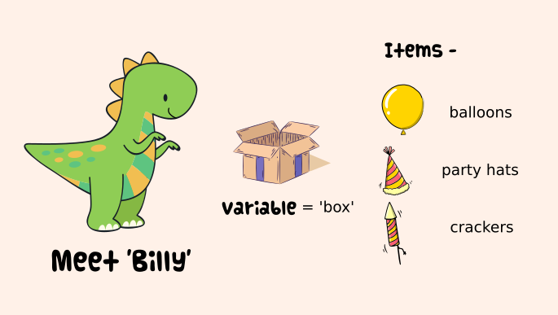

title: Variables
description: Learn how to create variables in Python 3

# Variables



<hr>

## Introduction

Let us see how to create {==variables==} in Python. In order to understand variables, I'd like you to meet {++Billy++}, he is a friendly dinosaur and is currently planning for his birthday party. Billy is very excited about the party and is busy thinking about packaging all the return gifts.

Billy has three type of return gifts -

1. Balloons
2. Party Hats
3. Crackers

## Declaring Variables

Let's start by creating a file called as 'variables.py' anywhere on your computer and open it in your code editor and type the following -

```python
box = 'Baloons'
print(box)
```

In order to run the file, open the terminal and navigate to the directory which contains the file.

Suppose I have created that file on my desktop, then the path on my terminal will be -

```bash
$ cd /Users/{your username}/Desktop
```

In order to run the file, type the following in your terminal -

```bash
$ python3 variables.py
```

Output will be as follows -

    Baloons

Congratulation! You just created a variable and printed its value.

## Understanding Variables

Let us again have a look at the code we wrote above

```python hl_lines="1"
box = 'Baloons'
print(box)
```

You are declaring a variable called {==box==} and assigning it a value of {==Baloons==}, note the single quote around it, you can also use double quotes as follows and it will give you the same output.

```python
box = "Baloons"
print(box)
```

Single and double quotes can be used interchangeably, but be sure to use a consistent style all across your code.

## Printing Values

```python hl_lines="2"
box = 'Baloons'
print(box)
```

Line 2 prints the value of the variable 'box' to the terminal, which in our case is 'Baloons'.

    Baloons

{==print()==} is a builtin python function which we can easily use to print values.

## Re-assigning Values

Suppose, now Billy wants to pack 'Party Hats' instead of 'Baloons', then we can re-assign a new value to the same variable 'box'

```python hl_lines="1"
box = 'Party Hats'
print(box)
```

You can again check the value by running the file

    python3 variables.py

Output

    Party Hats

Notice that our value has now changed from 'Baloons' to 'Party Hats'.

And now finally Billy wants to pack 'Crackers', so we can once again re-assign 'box' to a new value of 'Crackers'

```python hl_lines="1"
box = 'Crackers'
print(box)
```

If you run the file again, this time output will be

    Crackers

## Full Code

```python
# variables.py

box = 'Baloons'
print(box) # prints -> Baloons

box = 'Party Hats'
print(box) # prints -> Party Hats

box = 'Crackers'
print(box) # prints -> Crackers
```

## Conclusion

As you must have noticed {==box==} is just a placeholder, we can assign different values to it from time to time, thus it is know as a variable, i.e values can change but the placeholder remains the same.

## Please Consider a Donation ❤️

All the work is provided free of cost and completely open source, but it needs your support and love to keep the activity sustainable.

Any support is genuinely appreciated, you can help by sending a small donation by clicking the below link:

[](https://www.paypal.me/octallium)
