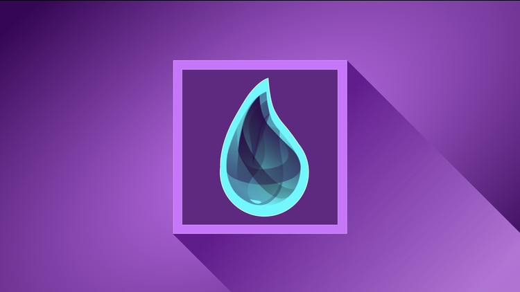

title: Installing Elixir
description: Learn how to install Elixir on your machine

# Installation



Learn how to install Elixir and how to setup your machine for development.

At the time of writing, the latest stable version is Elixir 1.10.0, you may have a different version depending when you are reading this tutorial.

## Mac OS

Installing Elixir couldn't be any easy, just make sure you have [Brew](https://brew.sh/) installed and then type the following in the terminal -

    brew install elixir

## Windows

On windows you can install Elixir as you would install just about any program, all you need to do is to [download](https://elixir-lang.org/install.html#windows) the installer and press next till it is installed.

## Other Platforms

Elixir offers excellent support for all other platforms including **FreeBSD** and other unix derived languages, check out [this](https://elixir-lang.org/install.html) page for documentation.

## Checking Installation

You can check the installation, by typing the following in your terminal or powershell -

    elixir -v

Output -

```bash hl_lines="3"
Erlang/OTP 22 [erts-10.6.4] [source] [64-bit] [smp:4:4] [ds:4:4:10] [async-threads:1] [hipe] [dtrace]

Elixir 1.10.2 (compiled with Erlang/OTP 22)
```

Line 3 indicates that Elixir 1.10.2 has been installed and Elixir has been compiled with Erlang 22.0

## Setting up your editor

Elixir is supported in all the leading editors and IDE's, two of the most commonly used editors are -

### VS Code

You only need to install [this](https://marketplace.visualstudio.com/items?itemName=elixir-lsp.elixir-ls) plugin. Optionally you can also install [this](https://marketplace.visualstudio.com/items?itemName=sammkj.vscode-elixir-formatter) plugin for code formatting.

### Atom

You need to install [this](https://atom.io/packages/language-elixir) plugin.

Further, I have read nice reviews for [Spacemacs](https://www.spacemacs.org/), however I have not tested it personally.

## Please Consider a Donation ❤️

If you would like to see articles coming up much faster then please consider a small donation. All the work is provided free of cost and completely open source, but it needs your support and love to keep the activity sustainable.

Any support is genuinely appreciated, you can help by sending a small donation by clicking the below link:

[](https://www.paypal.me/octallium)